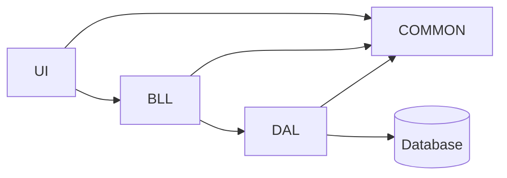

# Task-1 DDD back-end

## How many items from requirements was completed?
*  all

## Possible Drawbacks/Concerns (What should reviewers look out for?)
* Tests, maybe

## Testing Notes (How do we know this works & doesn't break other things)
* In unit testing in each service, GetAll() method checking will intentionally fail.

# Structure

* UI not realised into task-1.
* [BusinessLogic Layer](/src/TicketManagement.BusinessLogic/) - Constains services and validations.
* [Common](src/TicketManagement.Common) - Contains entity classes and validation of exception class.
* [DataAccess Layer](src/TicketManagement.DataAccess/) - Contains repository for each entity.
* [Database](src/TicketManagement.Database/) - Project database.
* [Unit Tests](test/TicketManagement.UnitTests/) for BusinessLogic Layer.
* [Integration Tests](test/TicketManagement.IntegrationTests/) for DataAccess Layer.

# Steps how to check
Database deployment for tests:
1. Initially, build TicketManagement.Database project
2. Open Microsoft SQL Server Management Studio(SSMS) and connect to SQL Server
3. Now, we navigate the tree in the Object Explorer to the database to deploy to.
4. Then, right-click on the "Databases" and select "Deploy Data-tier Application…"
5. Click Next and select DAC package in build folder of TicketManagement.Database project to deploy him
6. Click Next everywhere

The project database contains the initial population of data.

# Credentials
none
