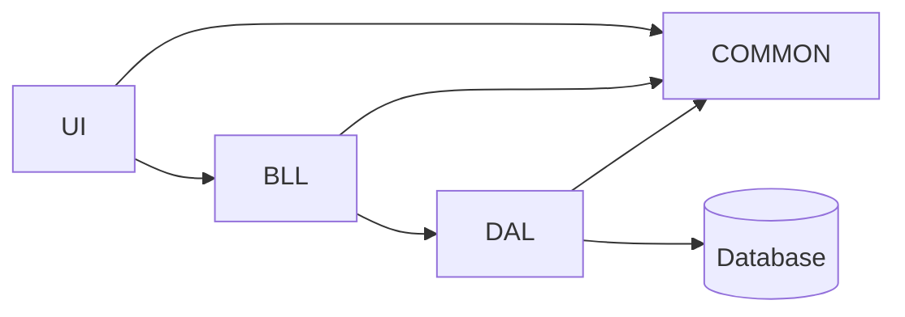

# Task-1 DDD back-end

## How many items from requirements was completed?
*  all

## Possible Drawbacks/Concerns (What should reviewers look out for?)
* Tests, maybe

## Testing Notes (How do we know this works & doesn't break other things)
* In unit testing in each service, GetAll() method checking will intentionally fail.

# Structure

* UI not realised into task-1.
* [BusinessLogic Layer](/src/TicketManagement.BusinessLogic/) - Constains services and validations.
* [Common](src/TicketManagement.Common) - Contains entity classes and validation of exception class.
* [DataAccess Layer](src/TicketManagement.DataAccess/) - Contains repository for each entity.
* [Database](src/TicketManagement.Database/) - Project database.
* [Unit Tests](test/TicketManagement.UnitTests/) for BusinessLogic Layer.
* [Integration Tests](test/TicketManagement.IntegrationTests/) for DataAccess Layer.

# Usage
* Create new instance of necessary bll.service of entity and use it.
Example:
```c#
var example = new AreaService();
```
* Use necessary method of Insert, Update, Delete, GetById, GetAll
Example:
```c#
example.Insert(Entity entity);
example.Update(Entity entity);
example.Delete(Entity entity); or example.Delete(int entity.id);
example.GetById(int entity.id);
example.GetAll();
```

# Steps how to check
Unit Tests for BusinessLogic Layer - testing with database transactions.
Integration tests for Data Access Layer.

The project database contains the initial population of data.

# Credentials
none
