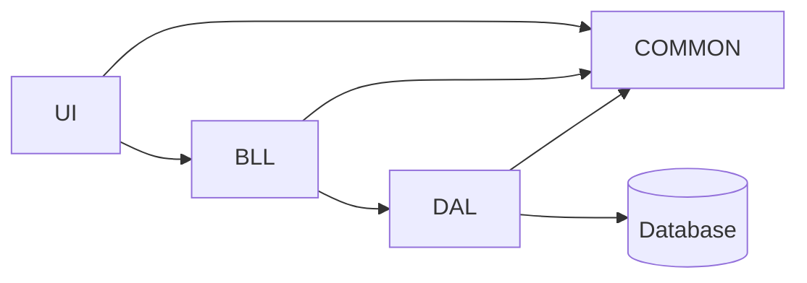

# Task-1 DDD back-end

## How many items from requirements was completed?
*  all

## Possible Drawbacks/Concerns (What should reviewers look out for?)
* 

## Testing Notes (How do we know this works & doesn't break other things)
* 

# Structure

* UI not realised into task-1.
* [BusinessLogic Layer](/src/TicketManagement.BusinessLogic/) - Constains services and validations.
* [Common](src/TicketManagement.Common) - Contains entity classes and validation of exception class.
* [DataAccess Layer](src/TicketManagement.DataAccess/) - Contains repository for each entity.
* [Database](src/TicketManagement.Database/) - Project database.
* [Unit Tests](test/TicketManagement.UnitTests/) for BusinessLogic Layer.
* [Integration Tests](test/TicketManagement.IntegrationTests/) for DataAccess Layer.

# Steps how to check
Deployment of the database for tests is automatic.

# Credentials
none
